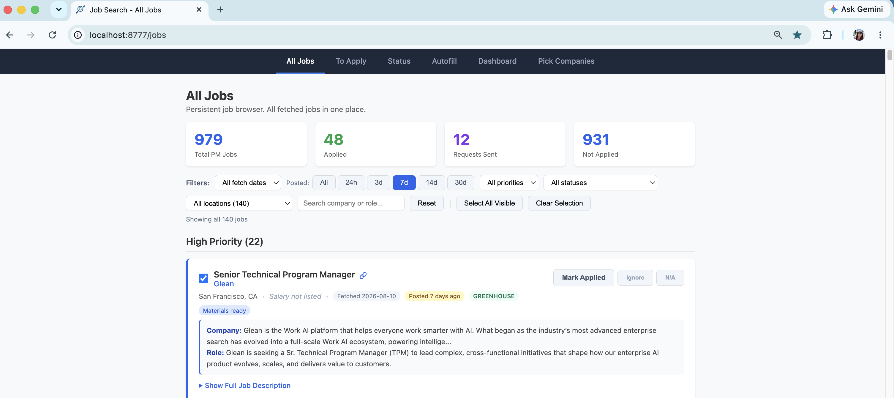
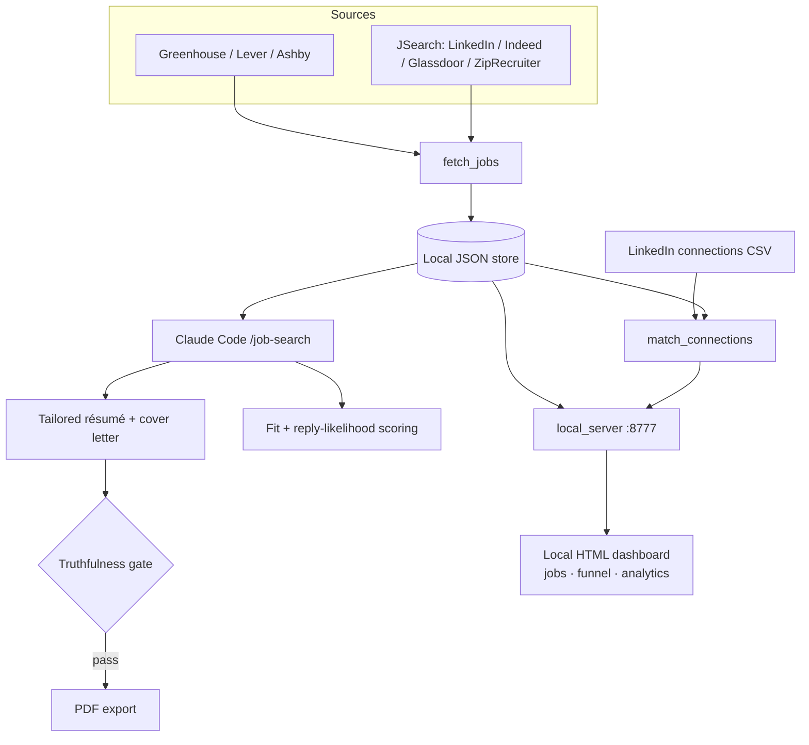

# job-search-and-tracker

> An AI-powered job-search automation tool that fetches real jobs, writes tailored résumés and cover letters, scores fit and reply likelihood, matches your LinkedIn connections to each opening, and tracks the whole funnel from a local dashboard.



It runs as a Claude Code slash command (`/job-search`) and ships with a local HTML dashboard, so the search stays fast, personalized, and entirely on your machine.

## Why it exists

A serious job search is a data problem wearing a writing problem. You are fetching hundreds of postings, tailoring materials for each one, figuring out who you already know at every company, and tracking what you sent and what came back. This tool automates the mechanical parts and puts an LLM on the parts that need judgment, while leaving the send button to you.

## What it does

- **AI job fetching from real sources.** Pulls open roles directly from company career pages on Greenhouse, Lever, and Ashby (free, no key), and optionally keyword-searches across LinkedIn, Indeed, Glassdoor, and ZipRecruiter through JSearch.
- **Tailored résumés and cover letters per job.** Generates materials against a specific job description, tuned to the role family, and exports professional PDFs.
- **LLM fit and reply-likelihood scoring.** Scores how well a role fits and analyzes outreach patterns so you spend effort where it is most likely to convert.
- **LinkedIn connection matching.** Surfaces which of your existing connections work at each target company, so you can ask for a warm intro instead of applying cold.
- **Outreach with A/B-tested messaging.** Connection requests come in four variants with a 300-character limit enforced; emails come with multiple subject-line variants, draftable straight into Gmail.
- **A local dashboard with full funnel tracking.** Browse fetched jobs, mark applications, and track outreach through `drafted → applied → interview → offer / rejected`, with response-rate analytics by message type, company size, and recipient role, served at `http://localhost:8777`.
- **A truthfulness gate.** A deterministic linter checks every generated document against a ground-truth fact sheet before a job is marked ready, so nothing overstates your experience.

## Architecture



## Your data stays local

Everything lives under the skill directory on your machine. Your profile, résumé, LinkedIn connections export, tracking data, and generated materials are all gitignored. The repository ships code, templates, and sample data only. Nothing personal is committed or transmitted anywhere you did not send it yourself.

## Stack

- **Language:** Python 3.9+ (standard library plus `reportlab` for PDFs)
- **AI:** runs inside Claude Code for tailored writing and scoring
- **Data sources:** Greenhouse / Lever / Ashby career pages; JSearch (RapidAPI) optional
- **Interface:** local HTML dashboard served at `http://localhost:8777`

## Quick start

```bash
mkdir -p ~/.claude/skills
git clone https://github.com/viviana-nieto/job-search-and-tracker.git ~/.claude/skills/job-search
```

Then, in any Claude Code session:

```
/job-search setup
```

The wizard collects your profile, target roles, keywords, LinkedIn connections, and an optional RapidAPI key, fetches a first batch of jobs, and opens the dashboard.

## Daily use

```
/job-search fetch jobs                                  # fetch jobs + refresh connection matches
/job-search write cover letter for [Company] [Role]     # tailored, truthfulness-checked
/job-search run pipeline                                # full pipeline for selected jobs
/job-search show stats                                  # outreach performance analytics
```
